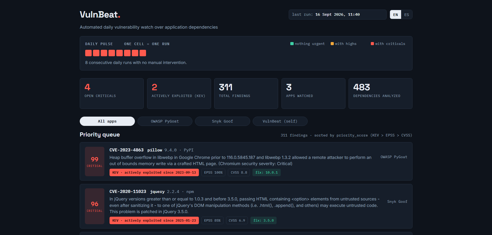

# VulnBeat


**Is what we already built still secure? Every day, automatically, VulnBeat answers that question for a project's real dependencies: as new vulnerabilities are published, which ones actually affect what's running, and which to fix first.**

One heartbeat a day. Check the pulse to see how healthy the last few runs have been.

🔗 **[Live dashboard](https://georgesgmg.github.io/vulnbeat/)**



## What it does

Every day at 06:00 UTC, with no manual intervention:

1. **Generates a real SBOM** (Software Bill of Materials) of each watched application via [Syft](https://github.com/anchore/syft).
2. **Scans the SBOM for real vulnerabilities** with [Grype](https://github.com/anchore/grype), matching by package URL (purl).
3. **Enriches every finding** by cross-referencing three independent public sources: [CISA KEV](https://www.cisa.gov/known-exploited-vulnerabilities-catalog) (confirmed active exploitation), [FIRST EPSS](https://www.first.org/epss/) (exploitation probability), and [NVD](https://nvd.nist.gov/) (CVSS score, descriptions — in English and, where available, Spanish, thanks to NVD's collaboration with Spain's INCIBE — and references).
4. **Discards invalid findings**: any match without a real CVE identifier (e.g. GHSA advisories with no CVE assigned) or with an NVD `Rejected` status is dropped, not published with placeholder data.
5. **Prioritizes** with a custom score: KEV > EPSS > CVSS (real-world exploitation outweighs theoretical severity — see [design decisions](#design-decisions)).
6. **Publishes** the result to a static, bilingual (EN/ES), responsive dashboard that accumulates history.

This product uses the NVD API but is not endorsed or certified by the NVD.

## Architecture

```
    public sources             scan                       output
 ┌───────────────────┐      ┌───────────────────┐      ┌─────────────────┐
 │ manifest+lockfile │ ───> │ Syft SBOM + Grype │ ───> │ match + scoring │
 └───────────────────┘      └───────────────────┘      └────────┬────────┘
                                      │                         │
                             KEV · EPSS · NVD enrichment        │
                                                                │
                                                           docs/data.json
                                                                │
                      GitHub Actions (daily cron) orchestrates everything
                                                                │
                                          GitHub Pages (static dashboard)
```

The dashboard (`docs/index.html`) is fully static and multi-language (EN/ES). UI strings live in `docs/assets/strings.json`, loaded and managed by `docs/assets/i18n.js`. The pipeline only rewrites `docs/data.json`; the page fetches it at load time.

## Design decisions

- **KEV outweighs CVSS.** A CVE with CVSS 9.8 that nobody exploits is less urgent than a 7.5 listed in the KEV catalog. The score reflects real risk, not theoretical severity.
- **Matching is purl-based.** Vulnerability matches come from Grype scanning a real SBOM (generated by Syft), matched by package URL (purl) — verified against real, live data across every watched app.
- **Known limitation:** Syft's own SBOM coverage of very large dependency trees (particularly transitive npm dependencies) is not exhaustive. In one verification run, the Syft-generated SBOM for one of the watched npm applications contained 437 components, while a direct `package-lock.json` parse (the project's own `inventory.py` module) identified 752 — a ~42% gap. Documented and accepted as a known trade-off of relying on Syft as the source of truth for components, not hidden.
- **Every finding must carry a real CVE identifier.** Matches that only resolve to a GHSA advisory with no CVE, or to a CVE marked `Rejected` by NVD, are dropped entirely rather than published with empty fields.
- **Cumulative JSON in the repo as persistence.** Enough for the current volume, versioned for free with git, and it makes the history auditable.
- **Secrets never touch the codebase.** Local development reads a git-ignored `.env` file; CI reads a GitHub Secret. Application code never reads environment variables directly — a small `Settings` object centralizes that.

## Run locally

```bash
pip install -r requirements.txt
pip install -e .
python3 -m vulnbeat.main
```

Syft and Grype must be installed separately (see [anchore/syft](https://github.com/anchore/syft) and [anchore/grype](https://github.com/anchore/grype)).

An NVD API key is optional but recommended: without it, NVD requests are throttled 10x slower. Request one at [nvd.nist.gov](https://nvd.nist.gov/developers/request-an-api-key) and set it as `NVD_API_KEY` in a local `.env` file.

## Watched applications

| App | Ecosystem | Source |
|---|---|---|
| OWASP PyGoat | PyPI | remote |
| Snyk Goof (nodejs-goof) | npm | remote |
| VulnBeat (itself) | PyPI | local |

To watch a different project, edit `apps.yml` — no code changes needed.